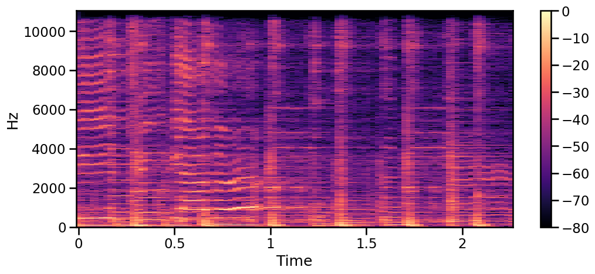

# Music Genre Classification using Machine Learning



## Project Overview
The main objective of this project is to challenge myself and expand my skill set. Initially, the focus will be on understanding audio signals and identifying the characteristics that differentiate one genre from another. The goal is to develop a machine learning model capable of effectively predicting the genre of any given song.

In later stages, I plan to compare this initial classification with a neural network model trained on classical visual representations of audio signals, such as waveforms and spectrograms. Additionally, I may explore natural language extraction and processing to further enhance the model's capabilities.

This project is a space for experimentation and learning. I will document each step of the process, highlighting key challenges and the new knowledge I acquire along the way.

## Table of Contents
- [Music Genre Classification using Machine Learning](#music-genre-classification-using-machine-learning)
  - [Project Overview](#project-overview)
  - [Table of Contents](#table-of-contents)
  - [Installation](#installation)
  - [**Usage**](#usage)
  - [Credits](#credits)

## Installation

**1. Clone the repository**
```bash
   git clone https://github.com/davidmayal23/music-genre-classification.git
   cd music-genre-classification
```
**2. Set up the environment**
Use `conda` or `pip` to install the necessary dependencies.
```bash
    conda env create -f environment.yml
    conda activate music-genre-env
```
**3. Download the dataset**

The dataset used is the [GTZAN Dataset](https://www.kaggle.com/datasets/andradaolteanu/gtzan-dataset-music-genre-classification), it is available in Kaggle. Download the dataset and place it in the `data/` folder:
```bash
    mkdir data/ && cd data/
```
Make sure your data folder looks something like this:
```bash
├── data/
│   ├── processed/
│   └── raw/
|   |   ├── genres_original/
|   |   ├── images_original/
|   |   ├── features_3_sec.csv  
|   |   └── features_5_sec.csv  
```

## **Usage**

This and the other sections will be filled as the project progresses.

## Credits
- [GTZAN Music Genre Dataset](https://www.kaggle.com/datasets/andradaolteanu/gtzan-dataset-music-genre-classification) – Used for training and testing the genre classification models.
- [Librosa](https://librosa.org/) – Python library for music and audio analysis, used for feature extraction.
- Inspired by [Analytics Vidhya's Guide](https://www.analyticsvidhya.com/blog/2022/03/music-genre-classification-project-using-machine-learning-techniques/) and [Farzana Anjum Medium Article](https://farzanaanjum.medium.com/music-genre-classification-with-python-51bff77adfd6) to music genre classification.

